# OpenReactor

Open-Source IEC nuclear fusion reactor control, monitoring, and data acquisition system

### Overview

OpenReactor is an open source reference design and control system for a small scale neutron-producing IEC fusor. The control system integrates with Pfeiffer high vacuum [turbo pumps](#vacuum-system), MKS and Edwards [high vacuum gauges](#high-vacuum-gauges), MKS and Sierra [mass flow controllers](#gas-delivery), [high voltage power supplies](#high-voltage-supply), and [proportional neutron counters](#neutron-emission-detection) and NIM instrumentation.

### Features

- Repeatable "one-click" fusion - OpenReactor runs reusable YAML configuration profiles and monitors power, vacuum, and gas delivery conditions to achieve fusion with no user interaction

- Mobile Control - a mobile web app communicates with the reactor to tweak settings remotely in real time over the network
- `kubectl`-inspired CLI for monitoring and control
- Realtime data logging and monitoring with InfluxDB and Grafana
- Modular microservice architecture
- 100% open source

### Architecture

TODO

## Hardware

### High Voltage Supply Controller

The [hv](https://github.com/natesales/openreactor/tree/main/cmd/hv) service controls and monitors a Spellman PTV power supply and communicates communicates with a [RP2040 over serial](https://github.com/natesales/openreactor/blob/main/cmd/hv/hv.ino). The microcontroller features an internal overcurrent shutoff, read from a ballast resistor to absorb momentary arcs during loss of vacuum conditions.

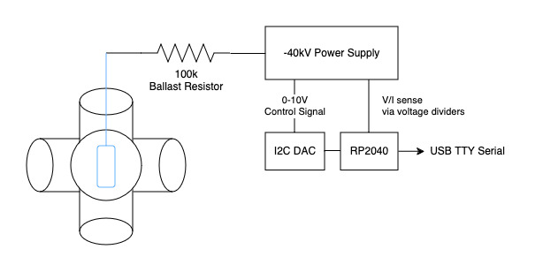

The power supply case is grounded to the chamber and mains earth throught the AC line side, and a RG8 coax cable supplies the high voltage output to the cathode feedthrough.

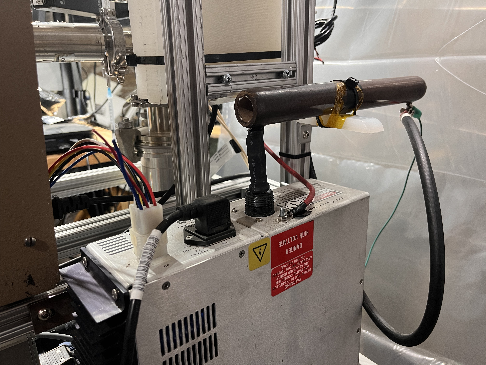

### Gas Conversion and Delivery System (GCDS)

The gas delivery conversion and delivery system manages Deuterium production and regulation via electrolysis and flow restriction. The system has two tasks:

1. Convert Deuterium Oxide (D2O) to Deuterium (D2) gas via electrolysis
2. Regulate gas flow into the central vacuum chamber

There are two independent gas supply lines connected to the vacuum chamber. The primary supply line handles gas conversion and closed-loop flow control, while a secondary manual syringe and needle valve allows the chamber to be purged with inert gas or short fusion runs when supplied with D2 gas.

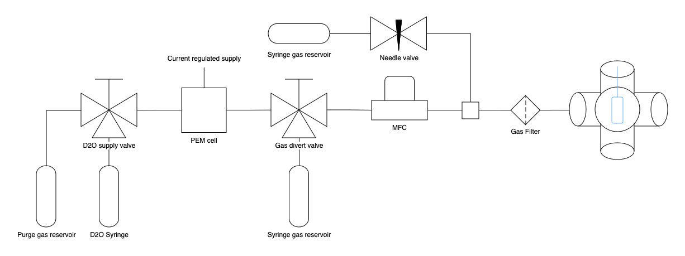

#### D2O to D2 Conversion

D2O is manually injected into a PEM cell mounted under the mass flow controller as needed prior to reactor operation. A 3-way luer lock valve on the PEM cell input supply tube permits a syringe to push any remaining liquid into the PEM cell to conserve D2O. The PEM cell output is connected to a second 3-way luer lock "divert" valve fitted with a reservoir syringe to store D2 gas during or prior to fusion operation. The divert valve enables the gas supply to come directly from the reservoir syringe or both the reservoir syringe and PEM cell for continuous operation.

#### Gas Regulation

The divert valve feeds the mass flow controller, which regulates gas flow from the reservoir syringe and, depending on
the divert valve position, the PEM cell too.

OpenReactor supports [MKS](https://github.com/natesales/openreactor/tree/main/cmd/mksmfc) and [Sierra](https://github.com/natesales/openreactor/tree/main/cmd/sierramfc) mass flow controllers. Each shares an identical internal REST API and communicates with the MFC over RS232 (Sierra) or USB to a [RP2040-based control board](https://github.com/natesales/openreactor/blob/main/cmd/mksmfc/mksmfc.ino).

|           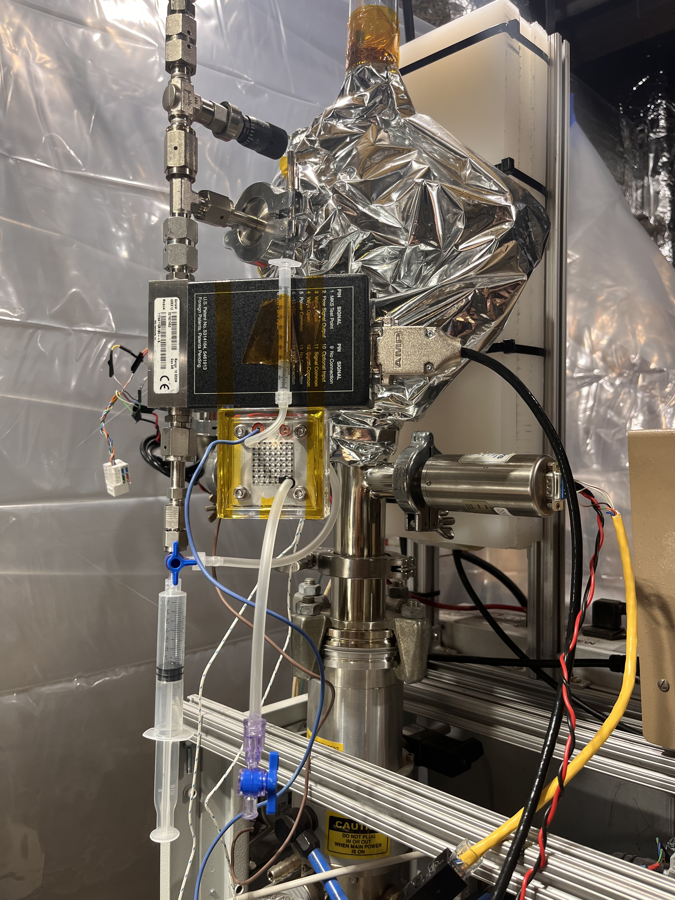           | 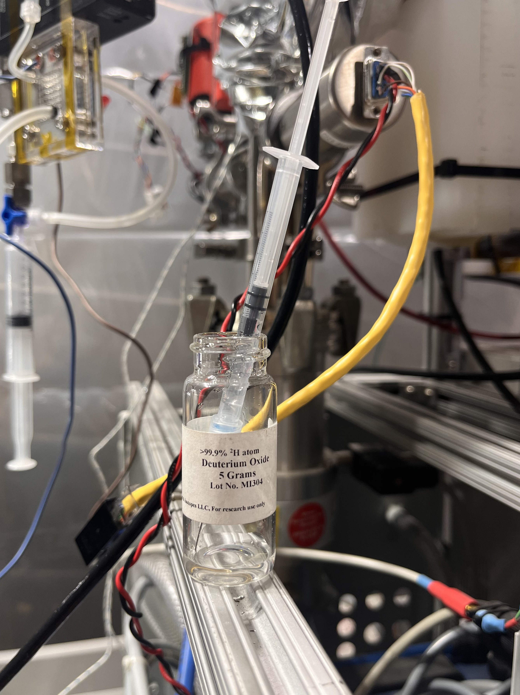 |
|:---------------------------------------------------:|:-------------------------------------:|
| GDCS with MFC, PEM cell, and adapter column visible |     Deuterium Oxide (Heavy Water)     |

All high vacuum fittings are 1/4" VCR, with a series of reducers to adapt down to a luer lock syringe connector.

### High Vacuum System

The high vacuum system consists of a series of pumps and gauges to pull and monitor the high vacuum environment in the chamber.

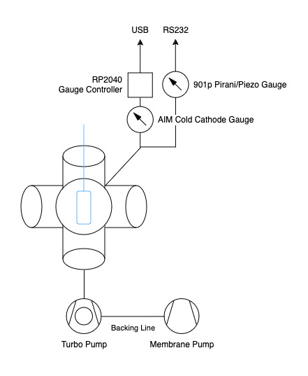

#### Turbo Pump Controller

OpenReactor supports the [Pfeiffer Vacuum Protocol](https://mmrc.caltech.edu/Vacuum/Pfeiffer%20Turbo/Pfeiffer%20Interface%20RS@32.pdf) to control an monitor a wide range of Pfeiffer turbo pump controllers and drive units.

##### Adding a RS232 port to a Pfeiffer turbo pump controller

Many turbo pump controllers have a panel mount RS232 port, but some expose RS232 over their X5 port which is blocked by the turbo pump control cable. In this case, it's trivial to break out the RS232 TX, RX, and ground lines to a small panel mount jack between the X1 and X2 ports.

| 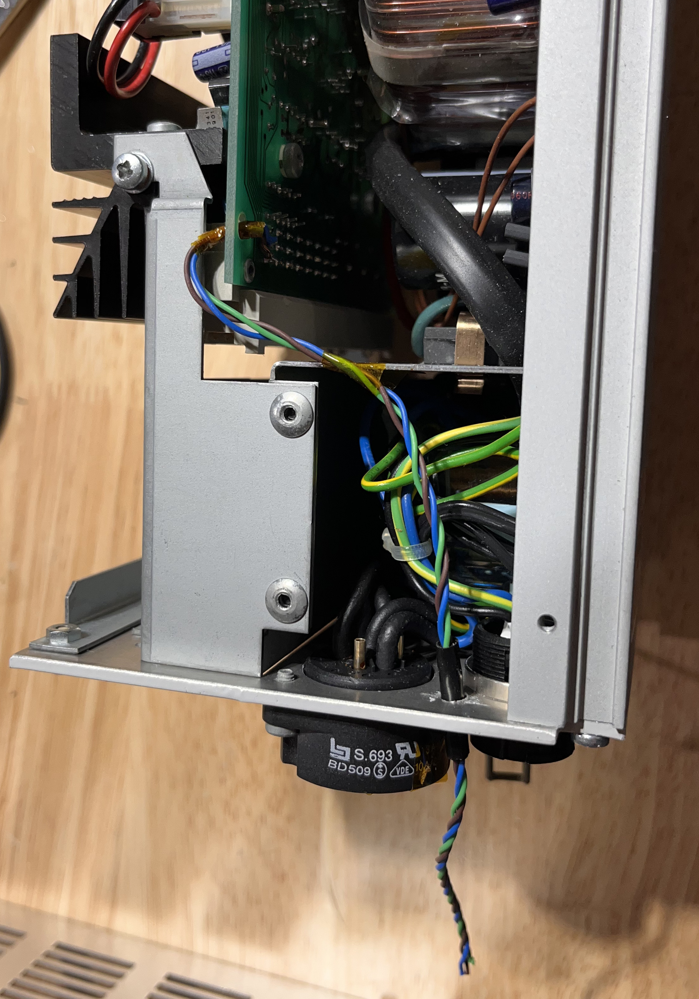 | 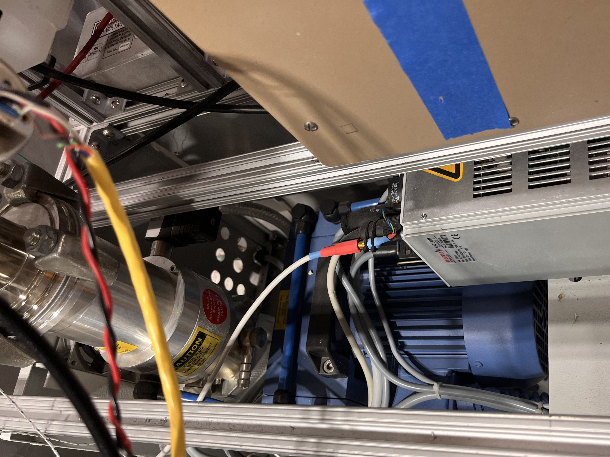 |
| :---------------------------------------: | :---------------------------------: |
| RS232 line added to the TCP control board | RS232 port via back panel connector |

#### Vacuum Gauges

OpenReactor supports [MKS](#MKS-Gauges) and [Edwards](#Edwards-Gauges) vacuum gauges for vacuum mesurement from atmospheric to 1e-9 Torr.

##### MKS

MKS gauges connect to the [mksgauge](https://github.com/natesales/openreactor/tree/main/cmd/mksgauge) service over RS232 and report all available pressure reading slots (PR1/PR2 for 901p pirani and piezo gauges).

##### Edwards

Edwards gauges connect to a RP2040-based gauge controller which controls the gauge enable state and reports the analog gauge output over USB. The [edwgauge](https://github.com/natesales/openreactor/tree/main/cmd/edwgauge) service converts the analog gauge signal to a vacuum level according to an interpolation profile (currently supports Edwards AIM-S and APG-L). Adding other gauges and gas-dependent curves is as easy as adding a new set of interpolation points to the [YAML config](https://github.com/natesales/openreactor/blob/main/cmd/edwgauge/gauge-lut.yml).

### Neutron Emission Detection

We detect neutron emissions using a proportional neutron counter tube, an amplifier, and a counter running on a RP2040. The [counter](https://github.com/natesales/openreactor/tree/main/cmd/counter) service logs the count rate over serial and supports any falling-edge PPS signal from a NIM rack or scalar.

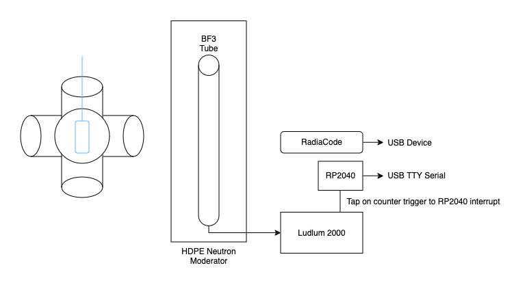

#### Adding a PPS output to the Ludlum 2000

Older Ludlum scalars don't have a RS232 interface like the new ones do, so instead of wiring up a microcontroller to read and control the internal counter's time base and reset state, we can simply expose the pulse signal and trigger an interrupt on a microcontroller. We can wire the counter pulse trigger pin through a voltage divider to get a 3.3V falling-edge PPS trigger signal, and then pass it through a panel mount BNC jack to a RP2040 digital input pin.

|        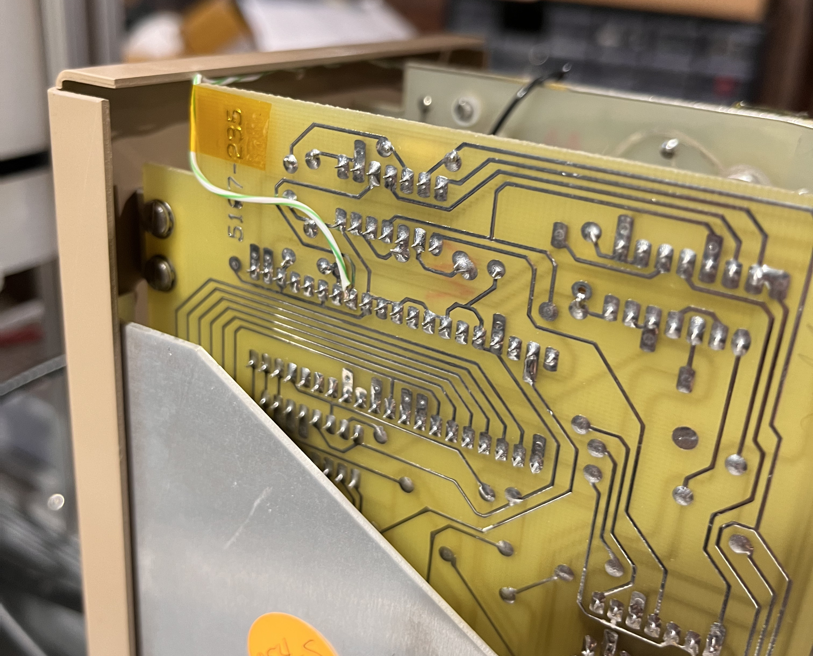         |    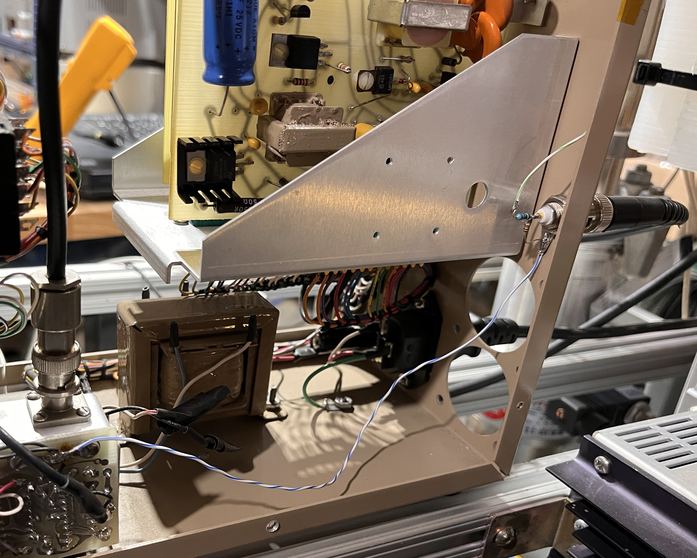     |
| :----------------------------------------------------: | :--------------------------------------------: |
| Tap on the count trigger pin on the 2000 control board | Panel mount BNC connector with voltage divider |

## License

This project is licensed under the MIT License - see the [LICENSE.md](LICENSE.md) file for details.
