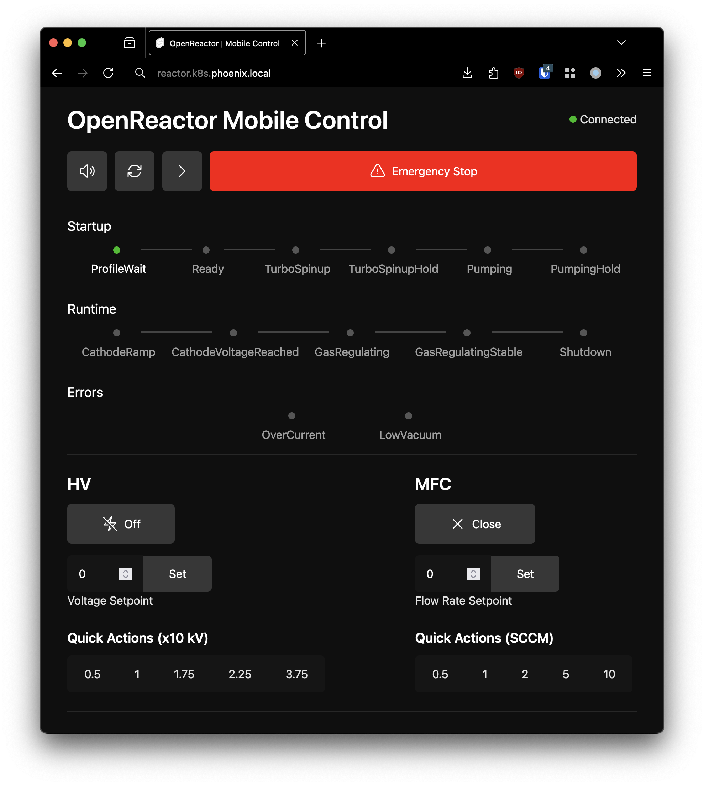
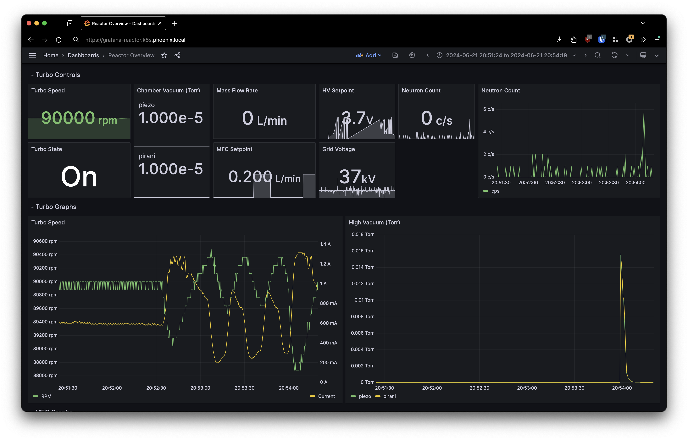

Each hardware subsystem (HV grid power supply, vacuum system, gas delivery, etc.) has an associated microservice for control and monitoring. They communicate over REST calls and WebSockets and store metrics in a central InfluxDB database.

# TODO: Architecture diagram

- Prewriting

    - OpenReactor runs as a collection of microservices that interface with the hardware components of a reactor.

      Each hardware subsystem communicates with it's microservice for control and logging over RS232/USB TTY serial.

    - How humans interface with the system
        - `fusionctl`

    - How computers interface with the system
        - API

The `service` package manages configuration, polling, and control of each service.

### Web UI




## Data Acquisition

Subsystem microservices write metrics to a central InfluxDB database.




## FSM

The reactor


### `fusionctl` CLI

The `fusionctl` CLI provides a `kubectl` -inspired interface to control and monitor the reactor. Fusion profiles are

```
$ fusionctl status
HV:
  Setpoint: 0.00 v
  Voltage: 0.00 kV
Vacuum:
  Level: 1.00e-5 Torr
Turbo:
  Running: false
  Rotor Speed: 1502 Hz
  Rotor Current: 1.81 A
Neutrons:
  Count: 0 c/s
Gas:
  Setpoint: 0 sccm
  Flow: 0 sccm
```
