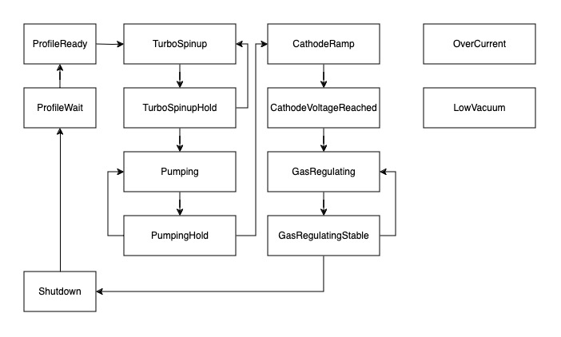

# TODO: Architecture diagram

    - How humans interface with the system
        - `fusionctl`

    - How computers interface with the system
        - API

The `service` package manages configuration, polling, and control of each service.


## Data Acquisition

Subsystem microservices write metrics to a central InfluxDB database.


## FSM

The reactor



### `fusionctl` CLI

The `fusionctl` CLI provides a `kubectl` -inspired interface to control and monitor the reactor. Fusion profiles are

```
$ fusionctl status
HV:
  Setpoint: 0.00 v
  Voltage: 0.00 kV
Vacuum:
  Level: 1.00e-5 Torr
Turbo:
  Running: false
  Rotor Speed: 1502 Hz
  Rotor Current: 1.81 A
Neutrons:
  Count: 0 c/s
Gas:
  Setpoint: 0 sccm
  Flow: 0 sccm
```
